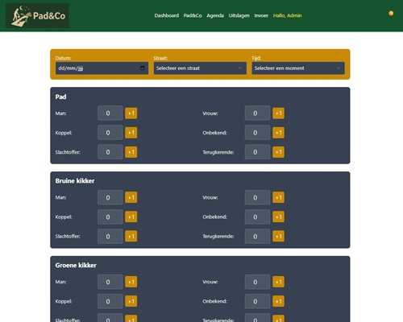
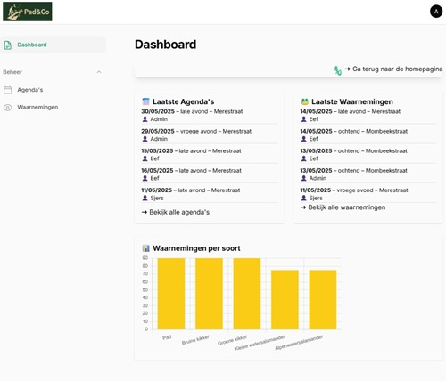
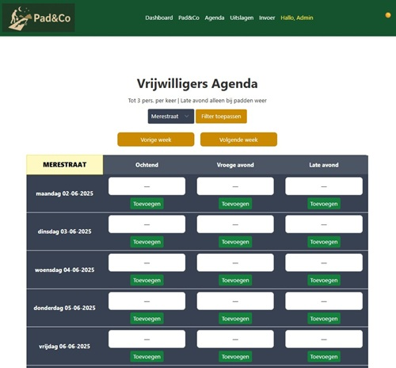
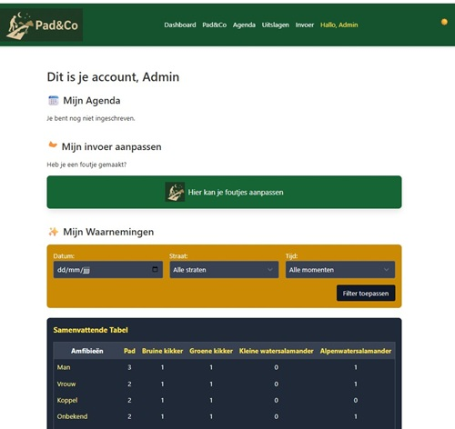

<!DOCTYPE html>
<html lang="nl">
<head>
  <meta charset="UTF-8" />
  <meta name="viewport" content="width=device-width, initial-scale=1" />
  <title>README – Padenco.site</title>
  
</head>
<body>

  <h1>Padenco.site</h1>
  
<strong>Een Laravel-applicatie voor het bijhouden van amfibieën-waarnemingen, agenda-items en administratief beheer via Filament
  Gegevens opgeslaan in mySQL database</strong>

  
  

  <h2>Inhoud</h2>
  <ol>
    <li><a href="#projectbeschrijving">Projectbeschrijving</a></li>
    <li><a href="#belangrijkste-functionaliteiten">Belangrijkste Functionaliteiten</a></li>
    <li><a href="#technische-stack">Technische Stack &amp; Dependencies</a></li>
    <li><a href="#mappenstructuur-bestanden">Mappenstructuur &amp; Belangrijke Bestanden</a></li>
    <li><a href="#installatie-setup">Installatie &amp; Setup</a></li>
    <li><a href="#configuratie-env">Configuratie (.env)</a></li>
    <li><a href="#database-migraties-seeders">Database-migraties &amp; Seeders</a></li>
    <li><a href="#frontend-gebruik-views">Frontend Gebruik (Views)</a></li>
    <li><a href="#filament-dashboard-admin">Filament-Dashboard (Admin)</a></li>
    <li><a href="#screenshots">Screenshots</a></li>
    <li><a href="#licentie-credits">Licentie &amp; Credits</a></li>
  </ol>

  

  <h2 id="projectbeschrijving">Projectbeschrijving</h2>
  

    Padenco.site is een interne Laravel-applicatie om amfibieën-waarnemingen te registreren, beheren en inzichten te genereren. Via een gebruiksvriendelijke frontend kunnen veldmedewerkers nieuwe waarnemingen invoeren, terwijl beheerders via het Filament-dashboard alle data, soorten, agenda-items en gebruikers beheren.  
  

  <blockquote>
    
<strong>Doelstelling:</strong>  
    – Centraal bijhouden van amfibieën-observaties in verschillende gemeenten.  
    – Inplannen en beheren van veldwerk-excursies via een agendafunctie.  
    – Groepen en rollen beheren met Filament voor een veilige admin-omgeving.

  </blockquote>

  

  <h2 id="belangrijkste-functionaliteiten">Belangrijkste Functionaliteiten</h2>
  <ul>
    <li><strong>Data Entry Form</strong> (waarnemingen): velden voor soort, locatie (gemeente/straat), tijdstip, aantal, toelichting, en optioneel foto-upload.</li>
    <li><strong>Soortenbeheer</strong>: CRUD-functionaliteit voor amfibieënsoorten, met categorieën en beschrijvingen.</li>
    <li><strong>Waarnemingenbeheer</strong>: filter, sorteer en exporteer waarnemingen via Filament.</li>
    <li><strong>Agenda</strong>: agendafunctie om toekomstige excursies, vergaderingen of deadlines in te plannen en te tonen op frontend.</li>
    <li><strong>Gebruikersbeheer</strong>: rollen en permissies via Filament (bv. ‘admin’, ‘medewerker’).</li>
    <li><strong>Responsive Frontend</strong>: eenvoudige Blade-views voor datainvoer, overzichtspagina’s en login/registratie.</li>
  </ul>

  

  <h2 id="technische-stack">Technische Stack &amp; Dependencies</h2>
  <ul>
    <li><strong>Laravel</strong> 10.x (PHP-framework)</li>
    <li><strong>PHP</strong> 8.0+</li>
    <li><strong>MySQL / MariaDB</strong> (Relational database)</li>
    <li><strong>Filament PHP</strong> (Admin dashboard &amp; CRUD)</li>
    <li><strong>NPM</strong> + <strong>Vite</strong> (Asset bundling: CSS, JS)</li>
    <li><strong>Composer</strong> (Package management)</li>
    <li>Belangrijke pakketten uit <code>composer.json</code>:
      <ul>
        <li><code>laravel/framework</code></li>
        <li><code>filament/filament</code></li>
        <li><code>spatie/laravel-permission</code> (rollen &amp; permissies)</li>
        <li><code>livewire/livewire</code> (dynamische componenten in Filament)</li>
        <li><code>laravel/sanctum</code> (API-authenticatie, indien nodig)</li>
      </ul>
    </li>
  </ul>

  

  <h2 id="mappenstructuur-bestanden">Mappenstructuur &amp; Belangrijke Bestanden</h2>
  <pre>
padenco/
├─ app/
│   ├─ Filament/
│   │   └─ Resources/
│   │       ├─ SoortResource.php
│   │       ├─ WaarnemingResource.php
│   │       ├─ AgendaResource.php
│   └─ Http/
│       ├─ Controllers/
│       │   ├─ WaarnemingController.php
│       │   ├─ AgendaController.php
│       │   └─ AuthController.php
│       │   └─ ...
├─ bootstrap/
├─ config/
│   └─ filament.php   (Filament-configuratie)
├─ database/
│   ├─ migrations/
│   │   ├─ 0001_01_01_000000_create_users_table.php
│   │   ├─ 2025_03_24_191620_create_tijden_table.php
│   │   ├─ 2025_03_24_191630_create_straten_table.php
│   │   ├─ 2025_03_24_192446_create_waarnemingen_table.php
│   │   ├─ 2025_03_24_192541_create_soorten_table.php
│   │   ├─ 2025_03_24_192630_create_categorieen_table.php
│   │   ├─ 2025_03_24_193021_create_agenda_table.php
│   │   ├─ 2025_03_25_133935_create_aantal_waarnemingen_table.php
│   │   └─ 2025_04_16_150958_add_name_changed_at_to_users_table.php
│   │   └─ ...
│   └─ seeders/
│       ├─ DatabaseSeeder.php
│       ├─ SoortenSeeder.php
│       ├─ CategorieenSeeder.php
│       ├─ DorpenSeeder.php
│       ├─ StratenSeeder.php
│       └─ TijdenSeeder.php
│       └─ ...
├─ public/
│   ├─ index.php
│   ├─ css/
│   │   └─ app.css
│   └─ js/
│       └─ app.js
├─ resources/
│   ├─ views/
│   │   ├─ layouts/
│   │   │   └─ layout.blade.php
│   │   ├─ header.blade.php
│   │   ├─ footer.blade.php
│   │   ├─ index.blade.php         (homepage & overzicht)
│   │   ├─ create.blade.php        (data entry form)
│   │   ├─ logout.blade.php
│   │   └─ (meer views voor login, account, etc.)
│   └─ css/                       (indien aanvullende styles)
│   └─ js/                        (indien aanvullende scripts)
├─ routes/
│   ├─ web.php                    (frontend & Filament routes)
│   └─ api.php                    (optioneel API-routes)
├─ .env.example
├─ composer.json
├─ package.json
├─ vite.config.js                (Vite-configuratie)
└─ README.html                   (dit bestand)
  </pre>

  
<em>Let op:</em> Mappen als <code>storage/</code> en <code>vendor/</code> staan in <code>.gitignore</code> en worden niet in de repo opgenomen.

  

  <h2 id="installatie-setup">Installatie &amp; Setup</h2>
  <ol>
    <li>
      <strong>Clone de repository</strong> 
      <pre>git clone https://github.com/jouw-gebruikersnaam/padenco.git
cd padenco</pre>
    </li>
    <li>
      <strong>Installeer Composer-dependencies</strong> 
      <pre>composer install</pre>
    </li>
    <li>
      <strong>Installeer NPM-dependencies &amp; compileer assets</strong> 
      <pre>npm install
npm run build</pre>
      (of voor lokale ontwikkeling: <code>npm run dev</code>)
    </li>
    <li>
      <strong>Kopieer en configureer <code>.env</code></strong> 
      <pre>cp .env.example .env</pre>
      Open <code>.env</code> en vul de juiste waarden in (zie volgende sectie).
    </li>
    <li>
      <strong>Genereer application key</strong> 
      <pre>php artisan key:generate</pre>
    </li>
    <li>
      <strong>Voer database-migraties uit</strong> 
      <pre>php artisan migrate</pre>
    </li>
    <li>
      <strong>Seed de database met voorbeelddata</strong> 
      <pre>php artisan db:seed</pre>
      (Voert alle seeders uit: Soorten, Categorieën, Dorpen, Straten, Tijden)
    </li>
    <li>
      <strong>Start de lokale ontwikkelserver</strong> 
      <pre>php artisan serve</pre>
      Bezoek vervolgens <code>http://localhost:8000</code> om de site te bekijken.
    </li>
  </ol>

  

  <h2 id="configuratie-env">Configuratie (<code>.env</code>)</h2>
  
Vul in <code>.env</code> de volgende variabelen met je eigen instellingen:

  <pre>
APP_NAME=Padenco
APP_ENV=local
APP_KEY=base64: (automatisch gegenereerd)
APP_DEBUG=true
APP_URL=http://localhost:8000

DB_CONNECTION=mysql
DB_HOST=127.0.0.1
DB_PORT=3306
DB_DATABASE=padenco_db
DB_USERNAME=padenco_user
DB_PASSWORD=secret

# Mail-instellingen (optioneel)
MAIL_MAILER=smtp
MAIL_HOST=smtp.example.com
MAIL_PORT=587
MAIL_USERNAME=null
MAIL_PASSWORD=null
MAIL_ENCRYPTION=null
MAIL_FROM_ADDRESS="no-reply@padenco.site"
MAIL_FROM_NAME="${APP_NAME}"

# Filament (indien aangepast)
FILAMENT_PATH=filament
  </pre>
  
<em>Tip:</em> Als je Filament onder een andere URL wilt bereiken (bijv. <code>/admin</code>), pas dan <code>FILAMENT_PATH</code> in <code>.env</code> en <code>config/filament.php</code> aan.

  

  <h2 id="database-migraties-seeders">Database-migraties &amp; Seeders</h2>
  
Alle migraties bevinden zich in <code>database/migrations/</code>:

  <ul>
    <li><code>0001_01_01_000000_create_users_table.php</code> – Standaard gebruikerssysteem</li>
    <li><code>2025_03_24_191620_create_tijden_table.php</code> – Tabel voor tijdslots</li>
    <li><code>2025_03_24_191630_create_straten_table.php</code> – Tabel voor straatgegevens</li>
    <li><code>2025_03_24_192446_create_waarnemingen_table.php</code> – Tabel voor geregistreerde waarnemingen</li>
    <li><code>2025_03_24_192541_create_soorten_table.php</code> – Tabel voor amfibieënsoorten</li>
    <li><code>2025_03_24_192630_create_categorieen_table.php</code> – Tabel voor categorieën van soorten</li>
    <li><code>2025_03_24_193021_create_agenda_table.php</code> – Tabel voor agenda-items</li>
    <li><code>2025_03_25_133935_create_aantal_waarnemingen_table.php</code> – Tabel voor totalen of samenvattingen</li>
    <li><code>2025_04_16_150958_add_name_changed_at_to_users_table.php</code> – Kolom om gebruikersnaam-wijzigingen bij te houden</li>
  </ul>
  
Seeders staan in <code>database/seeders/</code>:

  <ul>
    <li><code>DatabaseSeeder.php</code> – Roept alle volgende seeders aan</li>
    <li><code>SoortenSeeder.php</code> – Default amfibieënsoorten</li>
    <li><code>CategorieenSeeder.php</code> – Categorieën van soorten</li>
    <li><code>DorpenSeeder.php</code> – Lijst van dorpsnamen</li>
    <li><code>StratenSeeder.php</code> – Straatnamen per dorp</li>
    <li><code>TijdenSeeder.php</code> – Vooraf ingestelde tijdslots</li>
  </ul>

  

  <h2 id="frontend-gebruik-views">Frontend Gebruik (Views)</h2>
  
Alle Blade-templates bevinden zich in <code>resources/views/</code>. Belangrijke bestanden:

  <ul>
    <li><code>layouts/layout.blade.php</code> – Algemene lay-out met header en footer</li>
    <li><code>header.blade.php</code> – Navigatiebalk en logo</li>
    <li><code>footer.blade.php</code> – Footer met copyright en links</li>
    <li><code>index.blade.php</code> – Homepage en overzicht van waarnemingen</li>
    <li><code>create.blade.php</code> – Formulier voor het invoeren van nieuwe waarnemingen</li>
    <li><code>logout.blade.php</code> – Bevestigingspagina bij uitloggen</li>
    <li>Andere views voor login, account-overzicht, en agendapagina’s</li>
  </ul>
  

    <strong>Voorbeeld route in <code>routes/web.php</code>:</strong>
    <pre>
Route::get('/', [WaarnemingController::class, 'index'])->name('homepage');
Route::get('/waarnemingen/create', [WaarnemingController::class, 'create'])->name('waarneming.create');
Route::post('/waarnemingen', [WaarnemingController::class, 'store'])->name('waarneming.store');
Route::get('/agenda', [AgendaController::class, 'index'])->name('agenda.index');
Route::middleware(['auth'])->group(function () {
    Route::post('/logout', [AuthController::class, 'logout'])->name('logout');
    Route::get('/account', [AuthController::class, 'account'])->name('account');
});
    </pre>
  

  

  <h2 id="filament-dashboard-admin">Filament-Dashboard (Admin)</h2>
  
Filament biedt een grafische interface voor beheerders om modellen te beheren. De belangrijkste <code>Resources</code> bevinden zich in <code>app/Filament/Resources/</code>:

  <ul>
    <li><code>SoortResource.php</code> – Beheer amfibieënsoorten (naam, categorie, beschrijving)</li>
    <li><code>WaarnemingResource.php</code> – Beheer geregistreerde waarnemingen (soort, locatie, tijd, aantal)</li>
    <li><code>AgendaResource.php</code> – Beheer agenda-items (titel, datum, beschrijving)</li>
    <li><code>UserResource.php</code> – Beheer gebruikers en rollen</li>
  </ul>
  
<em>Toegang:</em> Navigeer naar <code>/filament</code> (of aangepaste <code>FILAMENT_PATH</code> in <code>.env</code>). Log in met een beheerder-account om de admin-functionaliteit te gebruiken.

  

  <h2 id="screenshots">Screenshots</h2>

  <h3>1. Gegevens Invoeren (Data Entry Form)</h3>
  
  
<em>Beschrijving:</em> Formulier met velden voor soort, locatie, tijd, aantal en toelichting.

  <h3>2. Dashboard Filament (Admin)</h3>
  
  
<em>Beschrijving:</em> Overzicht van Resources in Filament, zoals Soorten, Waarnemingen en Agenda.

  <h3>3. Agenda (Frontend)</h3>
  
  
<em>Beschrijving:</em> Geplande excursies en veldwerk in kalender-weergave.

  <h3>4. Accountpagina (Frontend)</h3>
  
  
<em>Beschrijving:</em> Gebruikersaccount-overzicht met opties om uit te loggen en profiel te bekijken.

  

  <h2 id="licentie-credits">Licentie &amp; Credits</h2>

  <h3>Licentie</h3>
  

    Deze applicatie valt onder de <a href="https://opensource.org/licenses/MIT" target="_blank" rel="noopener">MIT-licentie</a>.  
    Zie <code>LICENSE</code> voor de volledige tekst.
  

  <h3>Credits</h3>
  <ul>
    <li><strong>Ontwikkelaar:</strong> Evy Houbrechts</li>
    <li><strong>Backend-framework:</strong> Laravel (v10.x)</li>
    <li><strong>Admin Dashboard:</strong> Filament PHP (<a href="https://filamentphp.com" target="_blank" rel="noopener">filamentphp.com</a>)</li>
    <li><strong>Frontend-views:</strong> Blade-templating door Laravel</li>
    <li><strong>Styling en bundling:</strong> Vite &amp; Tailwind CSS (optioneel) / plain CSS</li>
    <li><strong>Database-seeders:</strong> SoortenSeeder, CategorieenSeeder, DorpenSeeder, StratenSeeder, TijdenSeeder</li>
  </ul>

  
Voor vragen of ondersteuning, stuur een e-mail naar <a href="mailto:evyhoubrechts@live.be">evyhoubrechts@live.be</a>.

</body>
</html>
